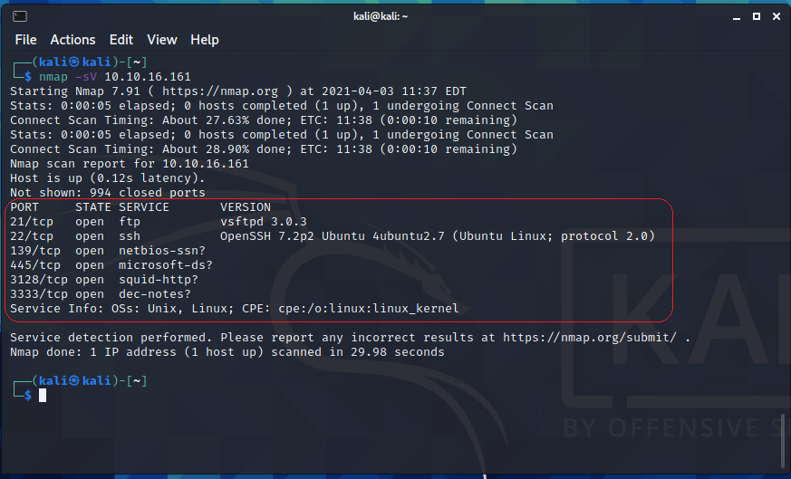
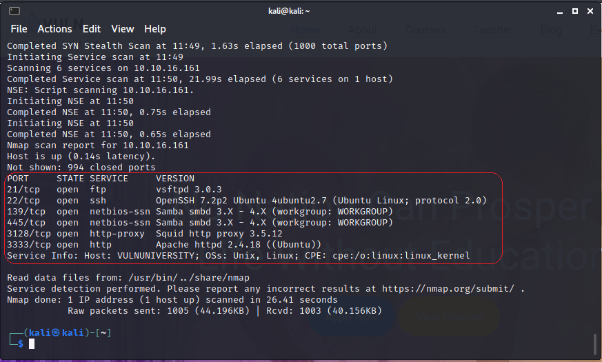
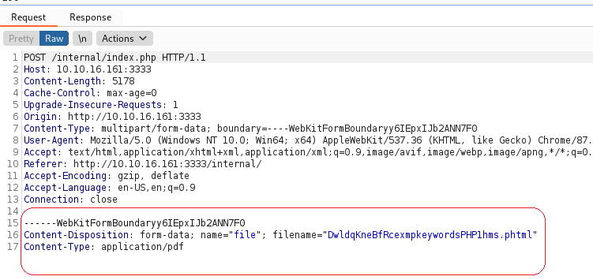
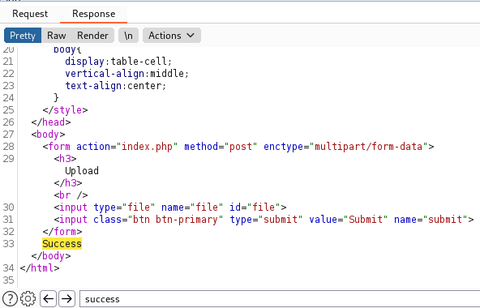
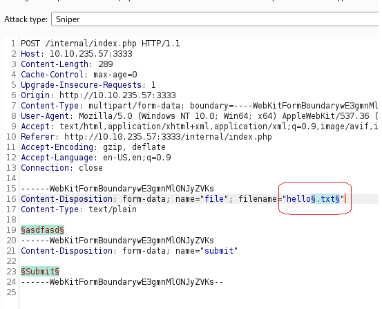
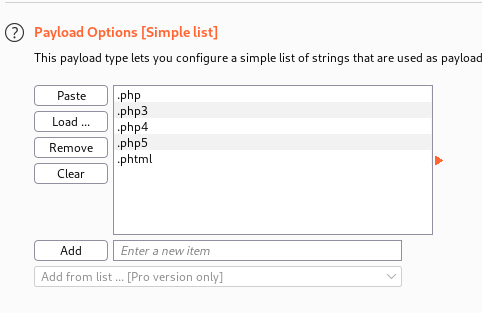
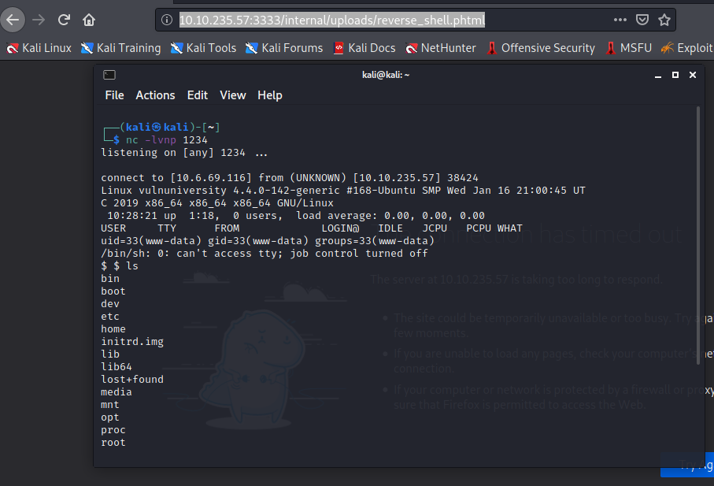
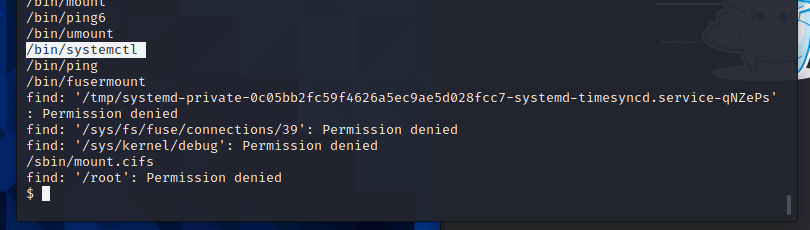

# Try Hack Me VULNUniversity
## Andrew Nichols

### 1. TryHackMe Start
- Installed Kali Linux VM to Desktop
- Connected OpenVPN connection using *sudo openvpn --config tryhackmeusername.ovpn* 
	
	***NOTE: tryhackmeusername.opvn** downloaded from tryhackme.com*

### 2. Task 2 Reconnaissance
- run nmap -sV server_ip 

**2.1 Open Ports**
	
- Six open ports found.

- When run with **verbose logging** (-v) Port 3333 shows an Apache http server

**2.2 Answers to Questions**

- Squid http Proxy is running version 3.5.12
- if you run nmap -n the DNS will not resolve.
- if nmap -p-400 was used 400 ports would be checked
- ubuntu is the OS running (states when looking at Apache webserver beside port 3333 Apache httpd 2.4.18 (Ubuntu))

### 3. Locating directories using GoBuster

- Installed GObuster on the Kali VM using sudo apt install gobuster
- Unzip rockyou.txt.gz using sudo gzip -d /usr/share/wordlists/rockyou.txt.gz this is a wordlist to use against in gobuster
- Run gobuster using 'dir' for directory '-u' for target URL http://server_ip:server_port '-w' path_to_wordlist
	- for me it is 'gobuster dir -u http://server_ip:3333 -w /usr/share/wordlists/rockyou.txt'
		
		*Note: Failed first time run, ran a ping command and the latency was around 130ms, reran command and worked*
		*Note: Also rockyou is huge took forver and started running into "too many open files error had to change the cmd"*
		*Note: -ulimit 8192 allowed for the fast and common wordlists to work /usr/share/dirb/common.txt and fast.txt*

- Working Command:  gobuster dir -ulimit 8192 -u http://server_ip:3333 -w /usr/share/wordlists/dirb/common.txt -t 10
		
	**Important Output**
		
		/images (301)
		/index.html (200)
		/internal (301)
		/js (301)
		/server-status (403)
	
	- anywhere between 200 and 399 are successfull outputs meaning the page does exist and/or you can access it

**3.1 Answers to Questions**
- The /internal URL gives a page to Upload a file. 

### 4 Compromise the webserver using Burp Suite's Upload Scanner Extension

*This will allow us to check which file types are allowed in the /internal upload page*

**References:** 

*[Installing Extensions in Burp Suite](https://portswigger.net/support/how-to-install-an-extension-in-burp-suite)*, 
*[Installing Jython in Burp Suite](https://gracefulsecurity.com/burp-suite-extensions-installing-jython-and-adding-an-extension/),
*[Using Upload Scanner](https://www.modzero.com/share/uploadscanner/UploadScanner_101_Basics.mp4)*

**4.1 Installing Upload Scanner Extension**
	
- Kali has Burp Suite pre-installed, however, it does not come with the Upload Scanner functionality by default.

- Need to download [Upload Scanner Extension](https://portswigger.net/bappstore/b2244cbb6953442cb3c82fa0a0d908fa "Upload Scanner") and Extract the contents to a folder.
- To use Upload Scanner we need to download the [Jython **standalond** JRE](https://www.jython.org/download "Jython Download Page") for use with Burp Suite.

	**Installing Jython standalone JRE**

	- Navigate to the **Extender** tab, select  **Options**
	- Under **Python Environment** Click **Select file...** and navigate to the jython standalone jar downloaded previously.
	- To Install, navigate to the **Extender** tab, select **Extensions**, select **Add** and under **Extension Details** change **Java** to **Python** as the Extension Type and browse to the extracted **UploadScanner.py**, and select **Next**.

**4.2 Using Burp Suite Upload Scanner**
	
- Open the GUI and navigate to the *Proxy* tab
	- Select the **Intercept On** button in blue to turn it off
	- Click **Open Browser** button to open a Chromium browser with the proxy settings configured for Burp Suite to intercept traffic
	- Navigate to the site with the upload form (in our case server_ip:3333/internal previously found using Gobuster and nmap)
	- Select the **Intercept is off** button to turn incetercepting back on.
	- Upload a test file (i just created hello.txt on the desktop) and select Submit.
	- In Burp Suite click the **Forward** button until the upload is complete and **Extension not allowed** shows.
	- Select the **HTTP history** tab and find the **POST** to your upload server (I sorted by Host and found the POST to /internal/index.php)
	- Right Click the **POST** and select **Send to Upload Scanner**

	- In the **Upload Scanner** tab, select **Start scan without ReDownloader**
	- Navigate to the **Done uploads** tab and it will be populated with each type of upload it has tested
	- Click the first completed upload and in the **Request** tab you will see the filename which is the test file uploaded
	- Clicking the **Reponse** tab will show you at the bottom **Extension not allowed** or **Success**
			- Scroll until you find **Success** in the **Resonse** tab.
			- Notice all the **Success** results are phtml files with Application type PDF.

	- Stop the scan by selecting the **1** tab and clicking **Stop scan**

**4.2 Burp Suite Intruder with wordlist**

- Create a wordlist text file with .php, php3, php4, php5, and phtml files
- Navigate to Proxy
- Turn Intercept Off
- Select Open Browser
- Navigate to the site we want to attack
- Turn Intercept back on
- Upload a file (the same file as previous works fine)
- In HTTPhistory, find the POST method where you uploaded your file, right click and **Send to Intruder**
- In the **Intruder** tab click **Positions**
- Add **§** before and after the uploaded file extension (there is a button to Add §)

	

- In the **Intruder** tab click **Payloads**
- Click **Load** under **Payload Options** and select your wordlist created earlier

	

- Select **Start attack**
- View the response and you see phtml has a successful upload

**4.3 Reverse Shell via PHP**

- Now that we can successfully upload phtml file types we can attempt to gain shell access via a reverse PHP shell
- Using a reverse php shell template from :
- Set the IP address to your internal IP (10.10.x.x)
- Using netcat (nc) we can listen on a port for IP connections 
	- using **nc -lvnp 1234** we can set netcat to (l)isten, (v)erbose, (n)o DNS only numeric IP addresses, on (p)ort 1234
- Once netcat is listening, we can then upload our reverse php code to the server
- Once uploaded we can then navigate to http://server_ip:3333/internal/uploads/name_of_reverse_shell_code.phtml
- Going back to the terminal with netcat listening, we will see a remote shell connection.

- Snooping around a bit we can see we are logged into the remote shell with the user www-data 
	- This user is the default user for ubuntu web servers.
- To get a list of all the users on the system run cat /etc/passwd and view the output
	- We can easily see there is only one non-default user added to the system named *bill*
	- In Bill's home directory there is a file named user.txt
		- running cat /home/bill/user.txt we find 8bd7992fbe8a6ad22a63361004cfcedb which is Bill's flag.

**4.4 Answers to Questions** 

- .php extensions are not allowed to be uploaded.
- .phtml extensions are allowed to be uploaded
- bill is the user that manages the webserver
- bill's flag is: 8bd7992fbe8a6ad22a63361004cfcedb

### 5 Privilege Escalation

- To find what files on the system have the ability to run as root we run the following command:
	- find / -perm /4000
	- Reading the output of the command we can scroll past any item in the /proc/ folder since we can not access it
	- we dow however find /bin/systemctl which controls the service manager and is a system utility.
		- systemctl can start, stop, restart, or enable/disable as well as check the status of a service. 

	